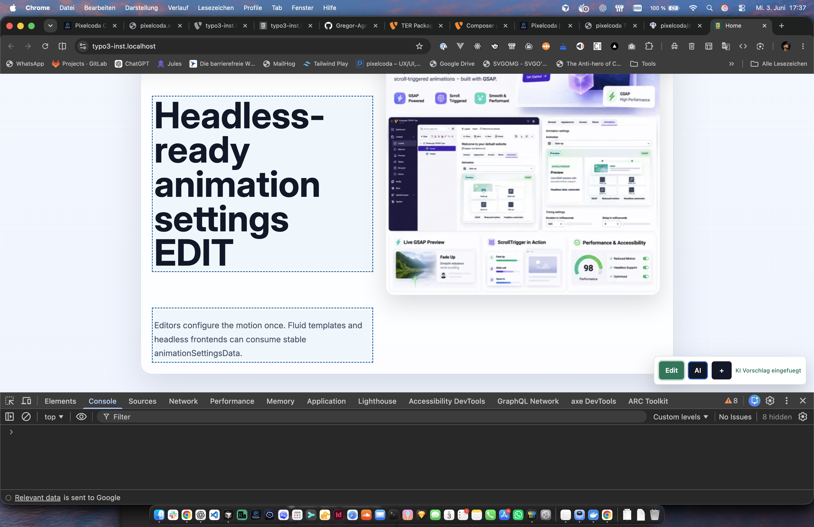
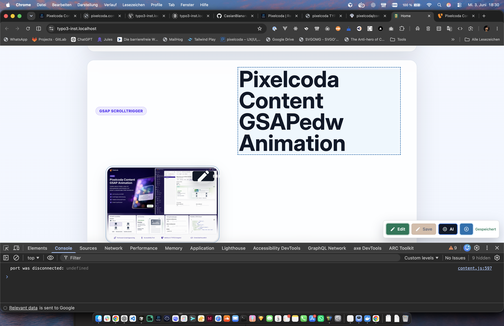
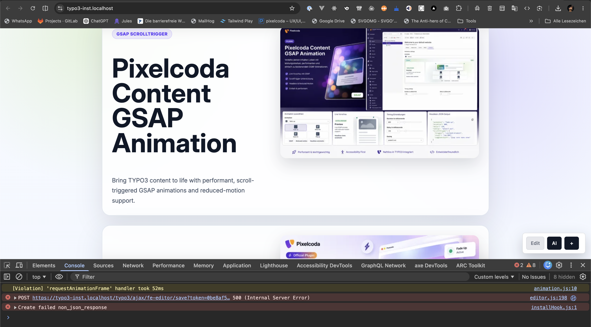

# Pixelcoda FE Editor

Frontend Editing for TYPO3 12, 13 and 14 with inline text editing, content creation, sorting controls, image editing shortcuts and an optional OpenAI-powered writing assistant.

> Status: alpha / active development. The extension is usable in the current project, but public API and UI details may still change.



## Features

- Frontend toolbar for authenticated TYPO3 backend users.
- Inline editing for `tt_content.header`, `bodytext` and related text fields.
- Autosave and manual save through TYPO3 `DataHandler`.
- CSRF protection through TYPO3 backend `FormProtection`.
- Content creation through the `+` button.
- Content sorting with drag-and-drop plus explicit `Up` / `Down` controls for large content elements.
- Image edit shortcut that opens the TYPO3 backend record editor for the owning content element.
- Optional OpenAI integration through a server-side TYPO3 Ajax endpoint.
- TYPO3 page cache clearing after save, create and reorder operations.



## Package Location

The installable TYPO3 extension lives in:

```text
packages/pixelcoda_fe_editor
```

Detailed extension docs are also available there:

```text
packages/pixelcoda_fe_editor/README.md
packages/pixelcoda_fe_editor/Documentation/Index.md
```

## Requirements

- TYPO3 `^12.4 || ^13.4 || ^14.0`
- PHP supported by the active TYPO3 version
- `typo3/cms-rte-ckeditor`
- Backend user with `tt_content` modify permission
- Optional: `OPENAI_API_KEY` for AI rewriting

## Installation

Composer path repository example:

```bash
ddev composer config repositories.fe-editor path ./packages/typo3_fe_editing/packages/pixelcoda_fe_editor
ddev composer require pixelcoda/fe-editor:@dev
ddev exec ./vendor/bin/typo3 extension:setup
ddev exec ./vendor/bin/typo3 cache:flush
```

For this project the root `composer.json` already uses the local path package:

```json
{
  "repositories": {
    "fe-editor": {
      "type": "path",
      "url": "./packages/typo3_fe_editing/packages/pixelcoda_fe_editor"
    }
  },
  "require": {
    "pixelcoda/fe-editor": "@dev"
  }
}
```

## How It Works

The extension registers a frontend PSR-15 middleware. If a backend user is logged in and has edit rights, the middleware injects:

- `Resources/Public/editor.css`
- `Resources/Public/editor.js`
- toolbar markup
- TYPO3 Ajax URLs
- CSRF token
- current page id
- metadata for editable `tt_content` records

Saving, creating, reordering and AI actions run through TYPO3 backend Ajax routes:

```text
POST /typo3/ajax/fe-editor/save
POST /typo3/ajax/fe-editor/ai
```

## Editing Text

Click `Edit`, select a marked headline or body text and edit directly in the frontend.

The extension detects editable fields in two ways:

- Native markers: `data-pc-field`, `data-table`, `data-uid`, `data-field`
- Fallback matching from current page `tt_content` records

Recommended Fluid markup:

```html
<h2 data-pc-field data-table="tt_content" data-uid="{data.uid}" data-field="header">
    {data.header}
</h2>

<div data-pc-field data-table="tt_content" data-uid="{data.uid}" data-field="bodytext">
    {data.bodytext -> f:format.raw()}
</div>
```

## Creating Content

The `+` button creates a new `tt_content` record on the current page. In the current demo layout it creates `CType=textpic`, because the frontend renders the demo cards from `textpic` records.

If your project renders all content types, adapt `createContentElement()` in `packages/pixelcoda_fe_editor/Resources/Public/editor.js` or add a proper content-type picker.

## Moving Content

In edit mode every content element gets a small control group:

- `::` drag handle
- `Up` move one element up
- `Down` move one element down

The explicit buttons are important for large content elements where drag-and-drop can be hard to control. Reordering updates `tt_content.sorting` through the save endpoint.

## Editing Images

The image button does not write FAL relations directly from the browser. It opens the TYPO3 backend record editor for the owning `tt_content` record. That keeps FAL references, permissions, workspaces and backend validation inside TYPO3.

## AI Service

The AI button sends the active editable field to the server-side `AiController`. The browser never receives the API key.

Configure in DDEV:

```bash
echo 'OPENAI_API_KEY=sk-...' >> .ddev/.env.web
echo 'OPENAI_MODEL=gpt-4.1-mini' >> .ddev/.env.web
ddev restart
ddev exec ./vendor/bin/typo3 cache:flush
```

Behavior:

- `header`: returns plain headline text
- `bodytext`: returns lightweight valid HTML
- missing key: the toolbar shows `OPENAI_API_KEY fehlt`

The endpoint uses the OpenAI Responses API:

```text
POST https://api.openai.com/v1/responses
```

## Screenshots

| Editing toolbar | Image edit |
| --- | --- |
|  |  |

| Route/debug state |
| --- |
|  |

## Development Checks

Run the project-local check script:

```bash
packages/pixelcoda_fe_editor/Build/check.sh
```

Manual checks from the TYPO3 project root:

```bash
find packages/typo3_fe_editing/packages/pixelcoda_fe_editor -name '*.php' -print0 | xargs -0 -n1 php -l
node --check packages/typo3_fe_editing/packages/pixelcoda_fe_editor/Resources/Public/editor.js
ddev exec ./vendor/bin/typo3 debug:backend:routes | rg 'ajax_fe_editor_(save|ai)'
```

Accessibility and Lighthouse checks:

```bash
npx --yes lighthouse https://typo3-inst.localhost/ \
  --chrome-flags="--headless --ignore-certificate-errors" \
  --only-categories=accessibility,best-practices,seo \
  --output=html --output=json \
  --output-path=packages/typo3_fe_editing/packages/pixelcoda_fe_editor/Build/reports/lighthouse

npx --yes pa11y https://typo3-inst.localhost/ \
  --config packages/typo3_fe_editing/packages/pixelcoda_fe_editor/Build/pa11y.config.cjs \
  --reporter cli
```

Current audit results are stored in:

```text
packages/pixelcoda_fe_editor/Build/reports/
```

The latest local audit reached:

- Lighthouse Accessibility: 100
- Lighthouse Best Practices: 100
- Lighthouse SEO: 100
- pa11y WCAG2AA: no issues found

## Troubleshooting

### Toolbar Is Not Visible

- Log into TYPO3 backend first.
- Check that the user is admin or has `tables_modify` for `tt_content`.
- Flush TYPO3 caches.

```bash
ddev exec ./vendor/bin/typo3 cache:flush
```

### AI Returns `OPENAI_API_KEY fehlt`

The key is not available inside the DDEV web container.

```bash
ddev exec printenv OPENAI_API_KEY
```

If empty, add it to `.ddev/.env.web` and restart DDEV.

### Changes Disappear After Reload

Check that the frontend renders real `tt_content` records and not hard-coded TypoScript or Fluid demo markup. The save endpoint writes to the database; the frontend must render the same records.

### Image Icon Is Too Large

The extension CSS forces toolbar icons to fixed dimensions with `!important`, because site CSS such as `.ce-gallery img { width: 100%; }` can otherwise affect overlay icons.

## Release Checklist

1. Update README and screenshots.
2. Run `Build/check.sh`.
3. Run Lighthouse and pa11y.
4. Flush TYPO3 caches and verify frontend manually.
5. Commit with a release-oriented message.
6. Tag release if needed.
7. Push branch and tags.

## Security Notes

- All writes go through TYPO3 `DataHandler`.
- CSRF is validated via backend `FormProtection`.
- AI API keys must be server-side environment variables.
- Ajax routes require an authenticated backend user.
- Direct FAL writes from frontend are intentionally avoided.

## Contact

- Email: [casianus@me.com](mailto:casianus@me.com)
- Website: [https://pixelcoda.de](https://pixelcoda.de)

## License

GPL-2.0-or-later
