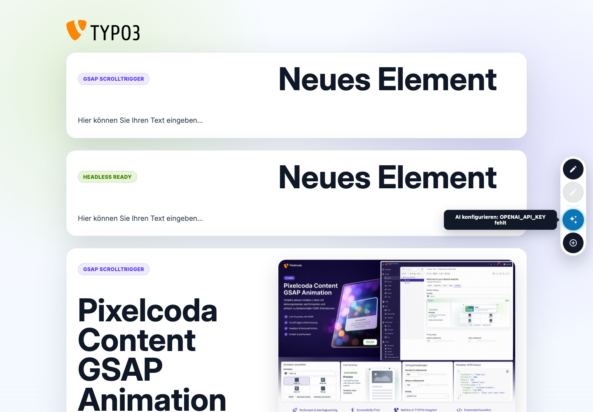
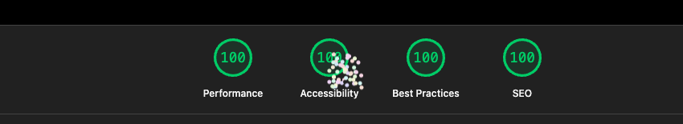
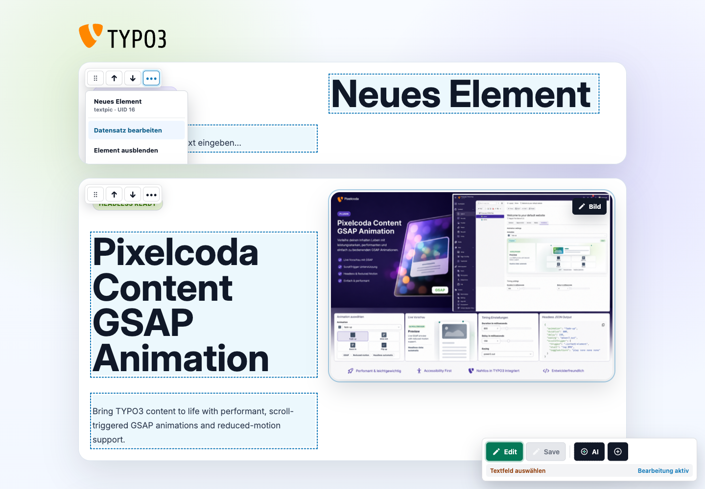
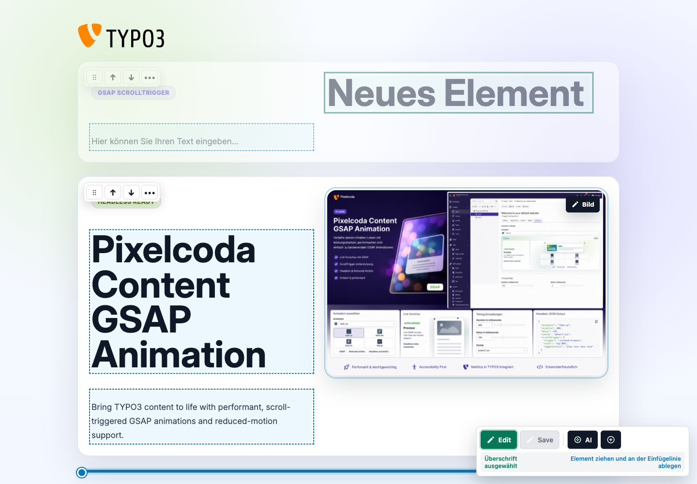
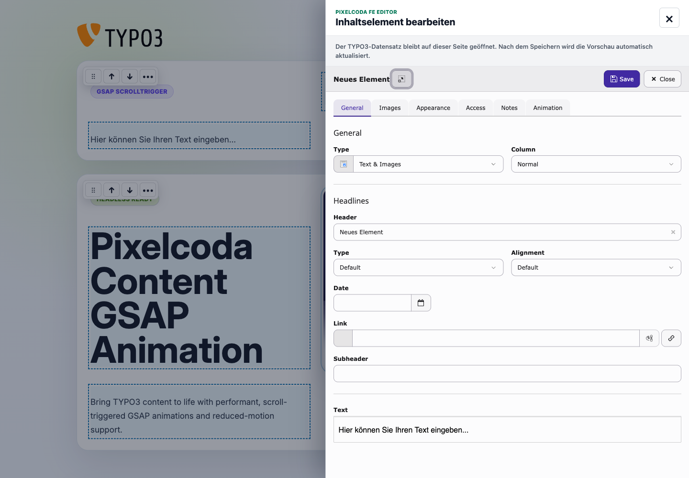
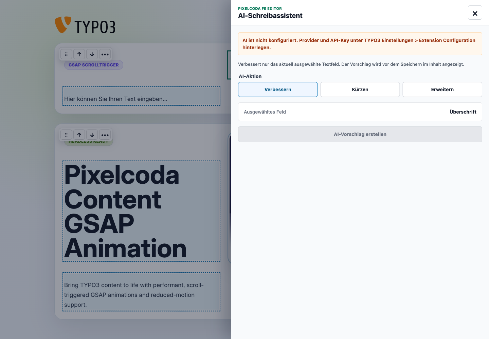

# Pixelcoda FE Editor Documentation

Documentation for accessible frontend editing, inline content editing, drag-and-drop sorting, contextual record editing and optional AI assistance in TYPO3 12, 13 and 14.



## Verified Quality



The reproducible local desktop audit reaches 100 in Performance, Accessibility, Best Practices and SEO. The complete report is available in `Build/reports/lighthouse.report.html`.

Start here:

- [README](../README.md)
- [Frontend editing overview](Images/editor-overview.png)
- [Premium element actions](Images/element-actions.png)
- [Content drag-and-drop](Images/content-drag-drop.png)
- [Contextual TYPO3 record editor](Images/contextual-editor.png)
- [AI writing assistant](Images/ai-assistant.png)

## Installation

After the first TYPO3 Extension Repository publication, install the stable
extension through Composer:

```bash
composer require pixelcoda/fe-editor
vendor/bin/typo3 extension:setup
vendor/bin/typo3 cache:flush
```

The TER extension key is `pixelcoda_fe_editor`.

## Visual Workflows

| Inline editing and element actions | Drag-and-drop sorting |
| --- | --- |
|  |  |

| Contextual TYPO3 editor | AI writing assistant |
| --- | --- |
|  |  |

## Existing Frontends

The editor automatically maps common TYPO3 content wrappers including `id="c123"`, `data-content-element-uid`, and `data-table="tt_content" data-uid`. It also matches unique content records from the current page. This supports many existing classic TYPO3 frontends without Fluid changes.

Headless frontends must expose a stable record identifier. Without one, identical rendered text cannot be mapped safely to a specific database record.

Administrators can disable all frontend editing UI for selected backend users or groups:

```typoscript
tx_pixelcodafeeditor.disabled = 1
```

## Side Canvas

Image and record editing stays on the frontend page. TYPO3's contextual record editor opens in an accessible right-side canvas. Native TYPO3 save events close the canvas and reload the frontend automatically.

Normal clicks stay in the side canvas. `Ctrl`/`Cmd`-click opens the full TYPO3 editor in a new tab for advanced FormEngine workflows.

The AI canvas provides field selection state and actions for improving, shortening, or expanding content. Provider keys remain server-side.

The standard content-element wrapper convention, UserTSconfig switch and contextual editing approach are maintained by Pixelcoda.

## Content Sorting

Content elements can be reordered directly in the frontend. Drag from the dedicated handle and drop at the visible insertion line. Arrow buttons provide the keyboard-accessible alternative. Only the affected content column is persisted through TYPO3 DataHandler. TYPO3 wrapper UIDs keep identical elements unambiguous, live status feedback confirms the save, and failed requests restore the previous order.

Enable the `pixelcoda/fe-editor` site set to render the included editable `pc_demo` content element without manually including static TypoScript.

The adjacent element-action menu provides contextual editing, hiding, and deletion with an accessible confirmation dialog.

Pixelcoda FE Editor is developed and maintained by Casian Blanaru (Pixelcoda).

## AI Configuration

Configure OpenAI, Anthropic Claude, OpenRouter, or Mistral under TYPO3 Extension Configuration for `pixelcoda_fe_editor`. Production environments should prefer environment variables.

## Accessibility

The side canvas uses dialog semantics, keyboard focus management, Escape-to-close, visible focus states, live status messages, responsive layouts, reduced motion, and automatic dark/light color schemes.

Contact:

- Email: [casianus@me.com](mailto:casianus@me.com)
- Website: [https://pixelcoda.de](https://pixelcoda.de)
